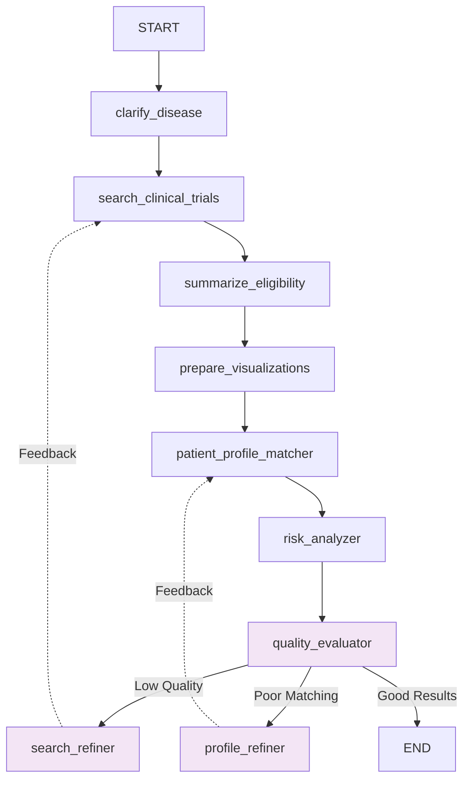

# LangGraph Workflow Documentation - Reflexion Structure

## Overview

This document describes the **reflexion-enhanced** LangGraph workflow for the Clinical Trials Search Application. The workflow now includes feedback loops and quality evaluation to continuously improve search results and user matching.

## Workflow Architecture

The workflow consists of **9 nodes** organized in a reflexion pattern with feedback loops:

### Core Processing Nodes (4)
1. **clarify_disease** - Disease name clarification and validation
2. **search_clinical_trials** - API search with refinement capability
3. **summarize_eligibility** - LLM-powered eligibility simplification
4. **prepare_visualizations** - Data processing for charts and graphs

### Personalization Nodes (2)
5. **patient_profile_matcher** - User profile matching with refinement capability
6. **risk_analyzer** - Trial risk assessment and safety analysis

### Reflexion Nodes (3)
7. **quality_evaluator** - Evaluates result quality and decides refinement strategy
8. **search_refiner** - Expands search terms and criteria
9. **profile_refiner** - Analyzes and improves user profile matching



## Node Details

### Reflexion Pattern Nodes

#### quality_evaluator
- **Purpose**: Evaluates the overall quality of workflow results
- **Inputs**: All workflow results, user profile, quality metrics
- **Logic**: 
  - Checks number of trials found (< 5 triggers refinement)
  - Evaluates personalized recommendation scores (< 3 high-scoring triggers refinement)
  - Analyzes risk distribution vs user tolerance
  - Checks location coverage for user preferences
- **Routing**: Conditionally routes to `search_refiner`, `profile_refiner`, or `END`

#### search_refiner
- **Purpose**: Expands and refines search criteria for better coverage
- **Inputs**: Quality metrics, current disease search terms
- **Logic**: 
  - Expands disease terms using synonym mapping
  - Includes related medical terminology (e.g., cancer → tumor, malignancy, neoplasm)
- **Feedback**: Loops back to `search_clinical_trials` with expanded terms

#### profile_refiner
- **Purpose**: Analyzes user profile limitations and suggests improvements
- **Inputs**: Quality metrics, user profile, current recommendations
- **Logic**:
  - Identifies age range limitations
  - Analyzes location/travel preference constraints
  - Evaluates risk tolerance vs available trials
- **Feedback**: Loops back to `patient_profile_matcher` with refinements

## State Management

### Enhanced AgentState Structure
```python
class AgentState(TypedDict):
    # ... existing fields ...
    quality_metrics: Dict[str, Any]        # Quality evaluation results
    search_strategy: Dict[str, Any]        # Search refinement data
    profile_refinement: Dict[str, Any]     # Profile improvement suggestions
```

### Quality Metrics
- **score**: Overall quality score (negative values indicate issues)
- **refinement_needed**: Boolean flag for refinement requirement
- **refinement_type**: "refine_search" | "refine_profile" | "none"
- **total_trials**: Number of trials found
- **high_score_trials**: Number of highly-matched trials
- **location_coverage**: Geographic coverage statistics

## Reflexion Benefits

### 1. **Adaptive Search Strategy**
- Automatically expands search terms when few results found
- Improves coverage without manual intervention
- Handles medical terminology variations

### 2. **Intelligent Profile Matching**
- Identifies when user profile limits options
- Suggests realistic adjustments to preferences
- Balances user requirements with availability

### 3. **Quality Assurance**
- Continuous monitoring of result quality
- Automatic refinement when quality thresholds not met
- User-transparent improvement process

### 4. **Self-Improving System**
- Learns from quality patterns
- Reduces manual parameter tuning
- Enhances user experience over time

## Conditional Routing Logic

```python
def route_based_on_quality(state: AgentState) -> str:
    quality_metrics = state.get("quality_metrics", {})
    
    if quality_metrics.get("refinement_needed", False):
        refinement_type = quality_metrics.get("refinement_type", "refine_search")
        if refinement_type == "refine_search":
            return "refine_search"
        elif refinement_type == "refine_profile":
            return "refine_profile"
    
    return "proceed"
```

## Performance Considerations

### Feedback Loop Prevention
- Maximum refinement iterations (implicit via state management)
- Quality threshold validation before triggering loops
- Graceful degradation when refinements don't improve results

### Efficiency Optimization
- Targeted refinements based on specific quality issues
- Minimal additional API calls (only when needed)
- Cached intermediate results where possible

## Future Enhancements

1. **Learning from User Interactions**: Track which refinements lead to better user engagement
2. **Multi-level Refinement**: Hierarchical refinement strategies for complex cases
3. **Predictive Quality Scoring**: ML-based quality prediction before workflow completion
4. **User Feedback Integration**: Incorporate explicit user feedback into refinement decisions

## Technical Implementation

The reflexion pattern is implemented using LangGraph's conditional routing:
- `workflow.add_conditional_edges()` for quality-based routing
- Feedback loops via `workflow.add_edge()` back to earlier nodes
- State persistence across all refinement cycles
